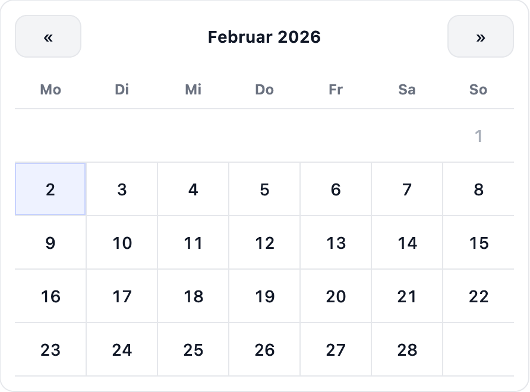

# Marten Calendar

[](https://github.com/treagod/marten-calendar/releases)
[](https://github.com/treagod/marten-calendar/actions/workflows/specs.yml)
[](https://github.com/treagod/marten-calendar/actions/workflows/qa.yml)

Marten Calendar is a Marten extension that provides the foundation for calendar- and scheduling-related features such as navigation between months, localized rendering, and (soon) event decoration. It is designed to get a production-ready month calendar on the screen quickly while still giving you hooks to extend templates or replace rendering logic entirely.

> **Note**: This shard is currently being bootstrapped. Documentation, features, and usage examples will continue to evolve as the implementation is built out.

## Checklist

- [x] Current calendar rendering functionality
- [x] Localized labels and weekday/month translations
- [ ] Month calendar event support
- [x] Ready to use CSS Styling

## Installation

Add the following dependency to your project's `shard.yml`:

```yaml
dependencies:
  marten_calendar:
    github: treagod/marten-calendar
```

Then run `shards install`.

Require the shard from your project's `src/project.cr` file:

```crystal
require "marten_calendar"
```

Finally register the application in your Marten configuration:

```crystal
config.installed_apps = [
  # …
  MartenCalendar::App
]
```

## Usage

### Template tag

This shard registers a `calendar` template tag. It renders a month grid that handles navigation helpers, optional min/max date constraints, and localized parsing for strings. By default the tag renders the templates that ship in `MartenCalendar::App`, but you can point it to custom templates via settings:

```crystal
Marten.settings.calendar.template_path = "calendar/month_calendar.html"
Marten.settings.calendar.cell_template_path = "calendar/month_calendar_cell.html"
```

In a template you can invoke it as follows:

```django

```

Supported kwargs include:

| Kwarg | Type | Default | Description |
| --- | --- | --- | --- |
| `year` | String or Int | Current year | Optional target year. Accepts literals or values pulled from the template context. |
| `month` | String or Int | Current month | Optional month number (1-12). Provide with `year` to jump to a specific month. |
| `week_start` | String | Monday | Set to `sunday` to render Sunday-first; any other value keeps Monday-first. |
| `fill_adjacent` | `Bool` | `false` | When `true` pads the first and last rows with adjacent-month days instead of blanks. |
| `min` | Time or String | `nil` | Smallest selectable day; accepts `Time` objects or ISO/localized strings (or `nil` to disable the constraint). |
| `max` | Time or String | `nil` | Largest selectable day; same parsing rules as `min` (or `nil` to disable). |
| `default` | Time or String | `nil` | Initially selected day; leave unset for no selection. |
| `template` | String | `Marten.settings.calendar.template_path` | Override the wrapper template path used for the whole calendar. |
| `cell_template` | String | `Marten.settings.calendar.cell_template_path` | Override the per-day cell template path. |



The shard also ships with a ready-to-use stylesheet that you can load via your asset pipeline:

```html
<link rel="stylesheet" type="text/css" href="" />
```

### Internationalization

Marten Calendar integrates with Marten’s `I18n` system out of the box. Month names, weekday headings, and navigation labels are rendered using the currently active locale, so the same templates work across multiple languages without additional logic in your handlers.

The shard ships with `src/marten_calendar/locales/en.yml`, which defines keys under `marten_calendar.calendar.*` (month names, weekday headers, navigation labels). Override or extend these translations from your own application by adding matching keys to your app’s locale YAML files, for example:

```yaml
en:
  marten_calendar:
    calendar:
      label: "Calendar"
      prev_label: "«"
      next_label: "»"
      month_names:
        january: "January"
        february: "February"
         # ...
      weekday_names:
        monday: "Mon"
        tuesday: "Tue"
        # ...
```

This allows you to keep your calendar UI fully translated alongside the rest of your Marten application while still using the generic `calendar` template tag shown above.

### Rendering from a handler

The shard is focused on the template tag only. If you want to preview the calendar while developing or use it inside a page, wire a handler in your project and feed the context the tag expects. The quick-start below renders the calendar inside `/calendar/`:

```crystal
class CalendarPage < Marten::Handlers::Template
  template_name "calendar/page.html"
end
```

Add the route in `config/routes.cr`:

```crystal
routes.draw do
  get "/calendar/", CalendarPage
end
```

Create `templates/calendar/page.html`:

```django


  <h1>Team calendar</h1>
  

```

Once this is wired up, restart your Marten server and load `/calendar/` to verify the tag renders.

## Development

```bash
shards install
crystal spec
```

CI also runs `bin/qa` before every release. Please run both commands locally and open a PR with a short description of the change plus any screenshots of new UI states. If you plan to add a new feature, propose it in Discussions or open an issue so we can align on API design first.
